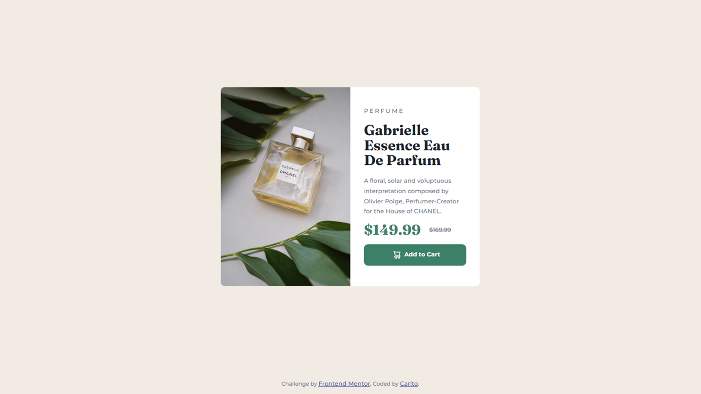

# Frontend Mentor - Product preview card component solution

This is my solution to the [Product preview card component challenge on Frontend Mentor](https://www.frontendmentor.io/challenges/product-preview-card-component-GO7UmttRfa).  
Frontend Mentor challenges help you improve your HTML, CSS and responsive layout skills by building realistic projects.

---

## Table of contents

- [Overview](#overview)
  - [The challenge](#the-challenge)
  - [Screenshots](#screenshots)
  - [Links](#links)
- [My process](#my-process)
  - [Built with](#built-with)
  - [What I learned](#what-i-learned)
  - [Continued development](#continued-development)
  - [Useful resources](#useful-resources)
- [Author](#author)

---

## Overview

### The challenge

Users should be able to:

- View the optimal layout depending on their device's screen size
- See hover and focus states for interactive elements

---

### Screenshots

  

---

### Links

- Solution URL: [My solution repo link](https://github.com/carodg09/product-preview-card)
- Live Site URL: [My live site link](https://carodg09.github.io/product-preview-card)

---

## My process

### Built with

- Semantic HTML5
- CSS custom properties
- Flexbox
- Mobile-first workflow
- `object-fit` for responsive images
- Google Fonts (`Fraunces`, `Montserrat`)
- GitHub Pages for deployment

---

### What I learned

This project helped me dive deeper into layout alignment and image rendering across breakpoints.  
Here are some key takeaways from this build:

- How to **use `object-fit: cover`** to make images fill their container without distortion, especially for a split layout.
- The difference between **`srcset` / `<picture>`** for responsive images and how to apply them correctly in a real-world layout.

---

### Continued development

Here are areas I plan to keep improving:

- Start writing styles in **Sass (SCSS)** and learn how to manage partial files and nesting better.
- Practice more with **component-based layouts** and use CSS Grid in more complex scenarios.
- Integrate **CSS animation and transitions** in a more polished and accessible way.
- Explore frameworks like **Vite + Sass** for faster prototyping.

---

### Useful resources

- [Sass documentation](https://sass-lang.com/guide) - Helped clarify why Sass must be compiled and how to use `$variables` and `@mixin`.
- [CSS Tricks: A Complete Guide to Flexbox](https://css-tricks.com/snippets/css/a-guide-to-flexbox/) - My go-to when aligning elements and fixing vertical centering issues.
- [Frontend Mentor Slack Community](https://www.frontendmentor.io/community) - Helpful threads on image alignment and object-fit behavior.
- [GitHub Pages Docs](https://docs.github.com/en/pages) - Helped me understand how to deploy my static site and share it online.

---

## Author

- GitHub - [@carodg09](https://github.com/carodg09)
- Frontend Mentor - [@carodg09](https://www.frontendmentor.io/profile/carodg09)